# Cosmos DB Firewall Updater

"Cosmos DB Firewall Updater" is a small utility which updates [IP firewall rules of Azure Cosmos DB account](https://docs.microsoft.com/en-us/azure/cosmos-db/how-to-configure-firewall) based on [servce tags](https://docs.microsoft.com/en-us/azure/virtual-network/service-tags-overview). This is useful when you would like to restrict access to your Cosmos DB database from specific Azure services in specific Azure regions.

You can specify a list of servce tags. "Cosmos DB Firewall Updater" periodically (once per day) updates IP firewall rules with a list of IP addresses (or IP address prefixes) generated from the servce tags.

"Cosmos DB Firewall Updater" is implemented as [a PowerShell function](https://docs.microsoft.com/en-us/azure/azure-functions/functions-reference-powershell) with [a timer trigger](https://docs.microsoft.com/en-us/azure/azure-functions/functions-bindings-timer) running on Azure Functions.

## Usage

1. [Create a Cosmos DB account](https://docs.microsoft.com/en-us/azure/cosmos-db/how-to-manage-database-account).

1. [Create a function app](https://docs.microsoft.com/en-us/azure/azure-functions/functions-create-scheduled-function).
    - Runtime stack: PowerShell Core

    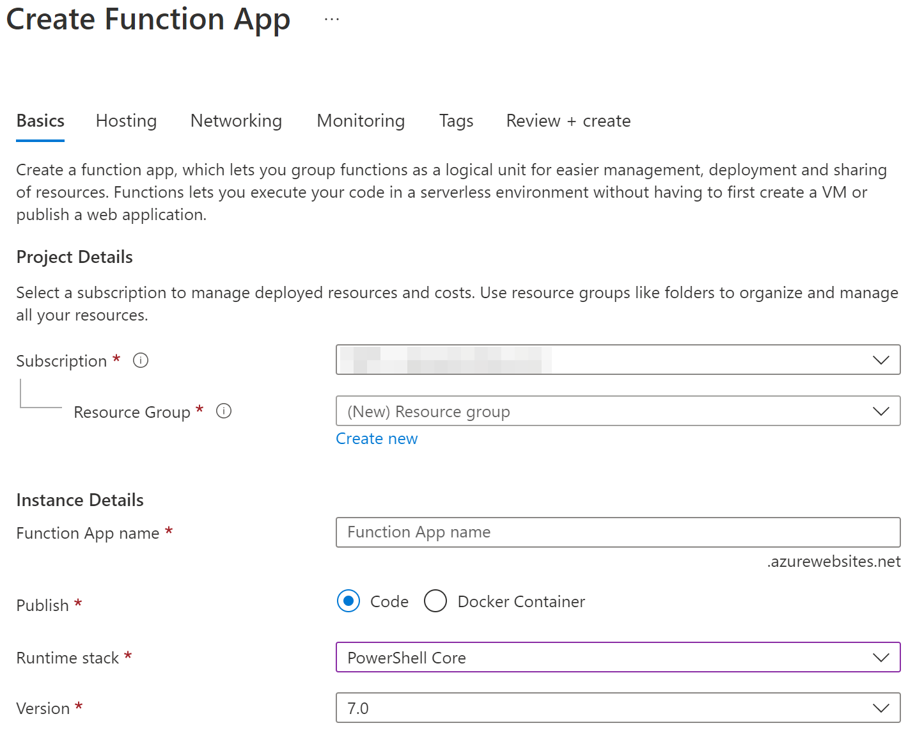

1. [Create a system assigned managed identity](https://docs.microsoft.com/en-us/azure/app-service/overview-managed-identity) for the function app.

    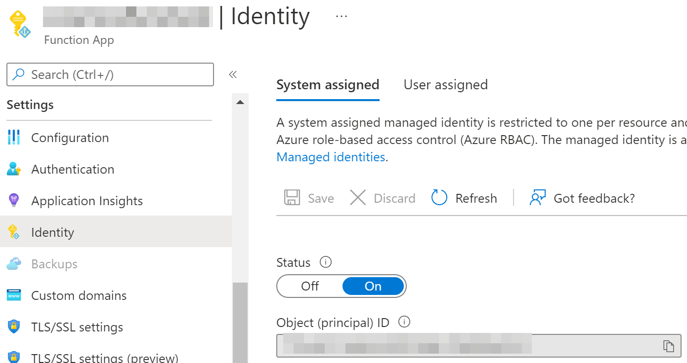

1. [Create a role assignment](https://docs.microsoft.com/en-us/azure/role-based-access-control/quickstart-assign-role-user-portal#grant-access) for the Azure subscription.
    - Role: Reader
    - Member: The managed identity of the function app

    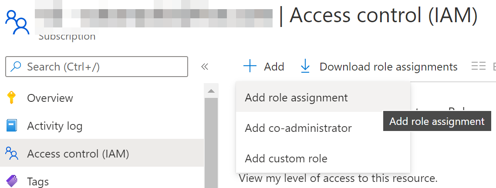
    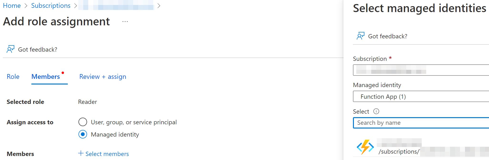

1. [Create a role assignment](https://docs.microsoft.com/en-us/azure/role-based-access-control/quickstart-assign-role-user-portal#grant-access) for the Cosmos DB account.
    - Role: Cosmos DB Operator
    - Member: The managed identity of the function app

    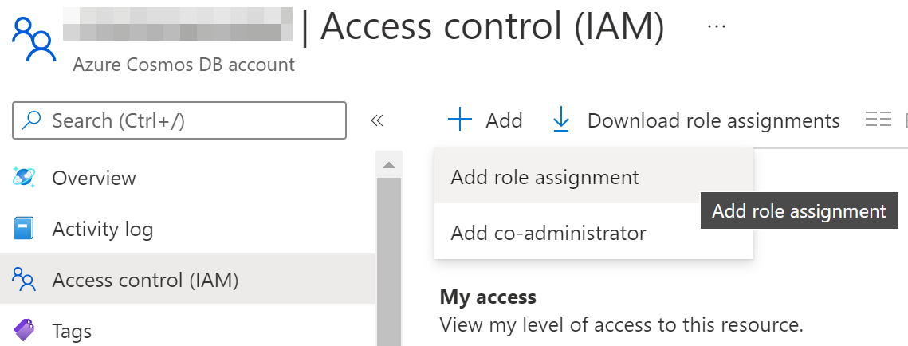
    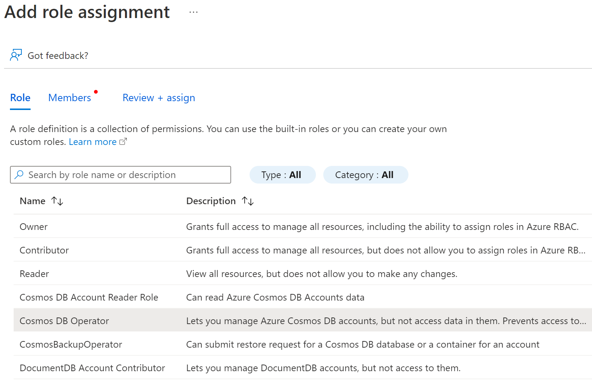

1. Verify role assignments to the managed identity.

    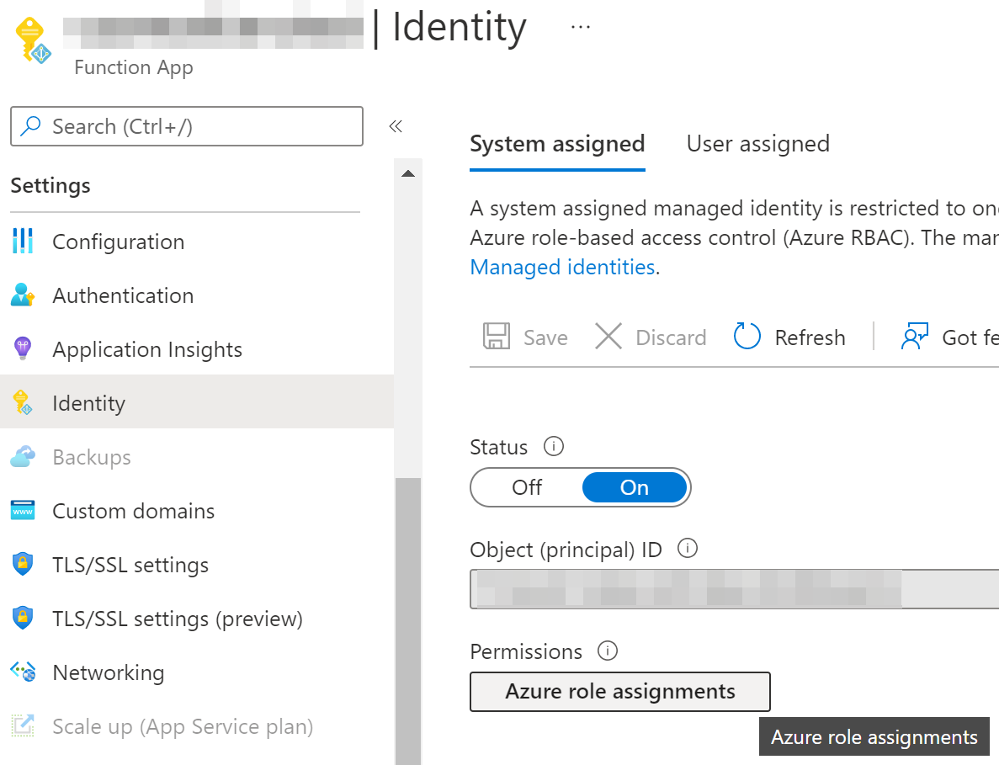
    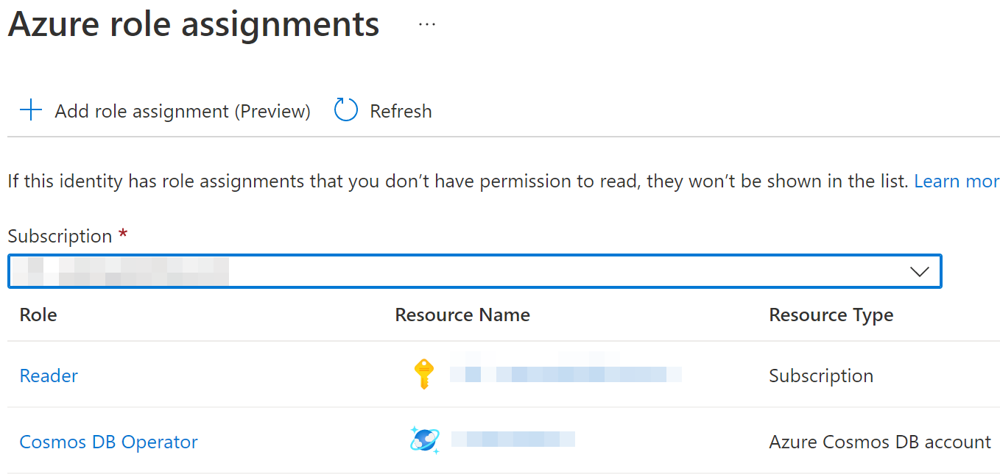

1. [Add application settings](https://docs.microsoft.com/en-us/azure/azure-functions/functions-how-to-use-azure-function-app-settings?tabs=portal#settings) to the function app

    | Name | Value | Example | Note |
    | - | - | - | - |
    | SubscriptionId | ID of Azure subscription | 326b86f3-0ec3-41f7-b058-623b4bc0253f | |
    | CosmosDbResourceGroup | Resoruce group name of Cosnmos DB account | myrg | |
    | CosmosDbAccount | Cosnmos DB account name | mycosmosdb | |
    | AllowedServiceTags | List of [service tags](https://docs.microsoft.com/en-us/azure/virtual-network/service-tags-overview) | AzureConnectors.JapanEast,AzureConnectors.JapanWest | Commma-separated list (without spaces) or empty. See [this site](https://azservicetags.azurewebsites.net/servicetag). |
    | AzurePortalIpAddresses | List of Azure Portal IP addresses | 104.42.195.92,40.76.54.131,52.176.6.30,52.169.50.45,52.187.184.26 | Commma-separated list (without spaces) taken from [this table](https://docs.microsoft.com/en-us/azure/cosmos-db/how-to-configure-firewall#allow-requests-from-the-azure-portal) or empty |
    | AdditionalIpAddresses | List of additonal IP addresses | 1.1.1.1,2.2.2.2,3.3.3.3 | Commma-separated list (without spaces) or empty |

    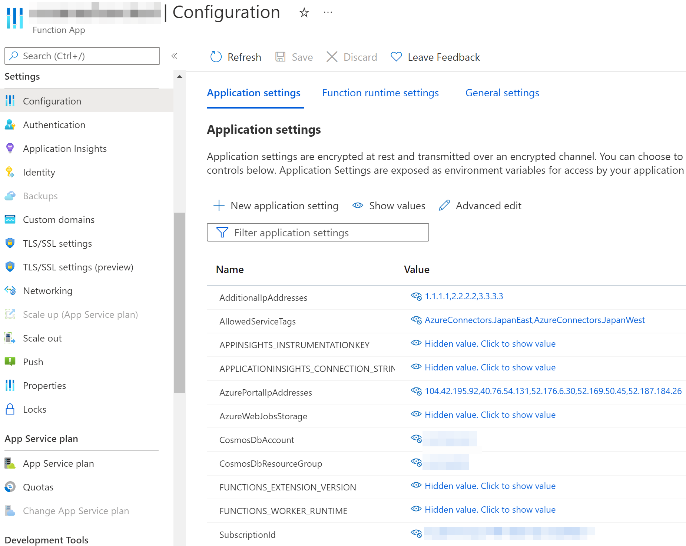

1. Open this GitHub repo in Visual Stuido Code, and [deploy the PowerShell function to the function app](https://docs.microsoft.com/en-us/azure/azure-functions/create-first-function-vs-code-powershell#publish-the-project-to-azure).

    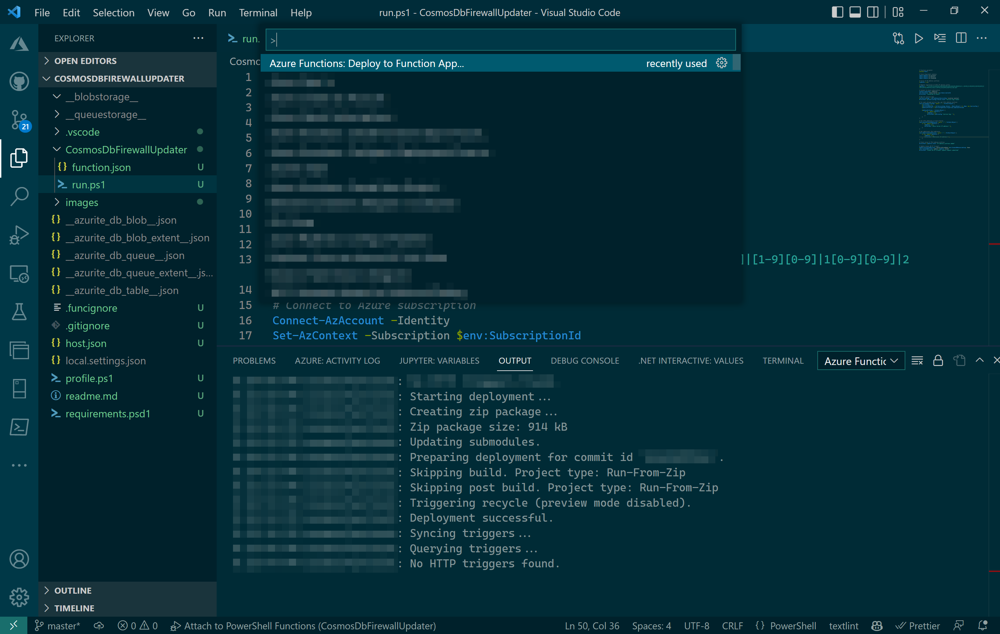

1. Test the function in Azure Portal.

    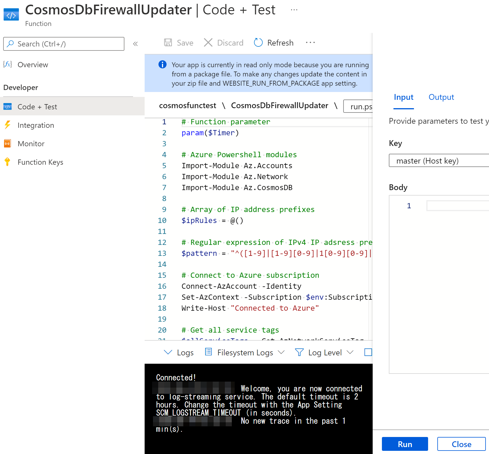
    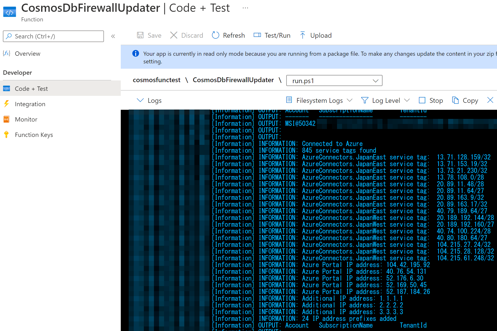

1. Check the status of the Cosmos DB account. The status is "Updating" while the update of the IP firewall rules is in progress.

    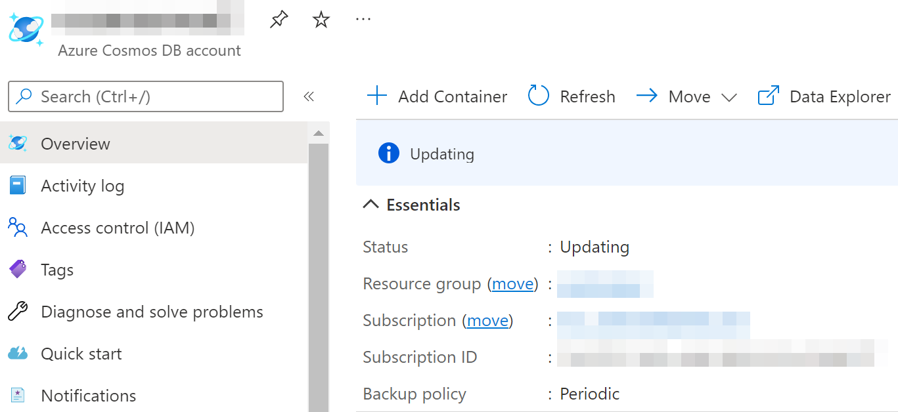

1. After the status is back to "Online", verify the IP firewall rules.

    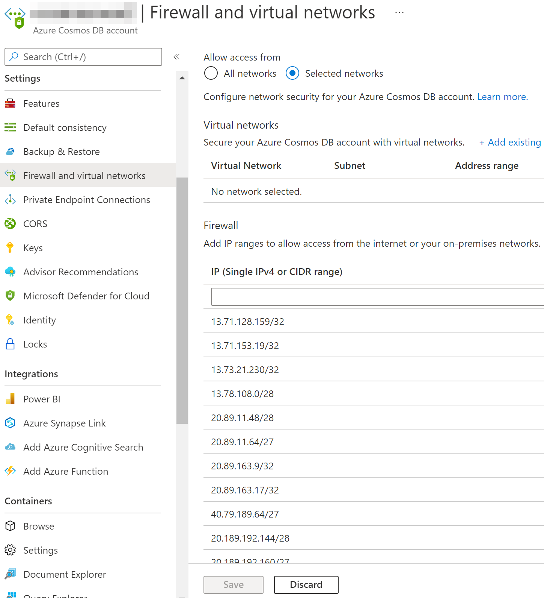
